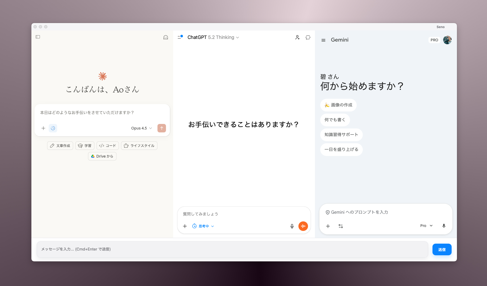

<div align="center">

# Seno

_**[seɪ-no]** — from Japanese「せーの！」meaning "ready, set, go!" — a phrase to start together in sync._

**Chat with Claude, ChatGPT, and Gemini — all at once.**

A native macOS app that displays three AI services side-by-side with a unified input field.

<br>



<br>

[](https://www.apple.com/macos/)
[](https://tauri.app/)
[](https://www.typescriptlang.org/)
[](https://www.rust-lang.org/)

</div>

---

## Features

- **Unified Input** — Type once, send to all three AI services simultaneously
- **Persistent Sessions** — Stay logged in across app restarts
- **Native Performance** — Built with Tauri for minimal resource usage
- **Zoom Control** — Adjust AI panel size from 50% to 200%
- **Dark Mode** — Automatic system theme detection

## Installation

### Requirements

- macOS 11.0+
- [Bun](https://bun.sh/) (or npm/pnpm)
- [Rust](https://rustup.rs/)

### Build from Source

```bash
# Clone
git clone https://github.com/aovoq/seno.git
cd seno

# Install dependencies
bun install

# Run in development mode
bun tauri dev

# Build for release
bun tauri build
```

## Keyboard Shortcuts

| Shortcut | Action |
|----------|--------|
| `⌘ Enter` | Send message to all |
| `⌘ N` | New chat (all services) |
| `⌘ R` | Reload all |
| `⌘ +` | Zoom in |
| `⌘ -` | Zoom out |
| `⌘ 0` | Reset zoom |

## Architecture

```
┌─────────────────────────────────────────────┐
│              Titlebar WebView               │
├──────────────┬──────────────┬───────────────┤
│    Claude    │   ChatGPT    │    Gemini     │
│   WebView    │   WebView    │   WebView     │
├──────────────┴──────────────┴───────────────┤
│              Unified Input Bar              │
└─────────────────────────────────────────────┘
```

Five WebViews in a single native window — each AI service maintains its own isolated session.

## Tech Stack

| Layer | Technology |
|-------|------------|
| Framework | Tauri v2 |
| Frontend | Vanilla TypeScript |
| Backend | Rust |
| Build | Vite |

## License

MIT
